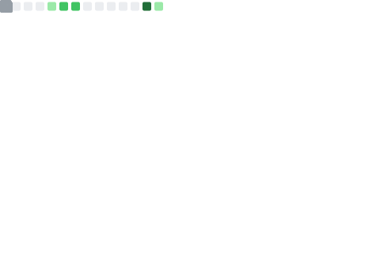

<h2 align="center">Hi! I'm Evan😃</h2>

<!--Keep Old Username-->

### 👋About me

Hey! I'm a **developer**. My name is **Evan**.
- 🌱 I am **currently learning TypeScript**.
- 🤗 **Pronouns**: *He/Him*.
- 💬 You can find me on [**Threads**](https://threads.com/@evan.tech).
- 📧 **Email**: [**Proton Mail**](mailto:evan.huang000@proton.me).
- 🖥️ **Portfolio**: [**Portfolio**](https://e.xyehr.cn)
- ⚡ **Hobbies**: *play games* 🎮 *and coding*😉.
- 🧩 **Tech Stack**: MERN

### 🔧Skills - Language and tools

### 📌Connect with me

  
  

  
  

### 🏷Information Card

<!--Thanks for watching😄-->
